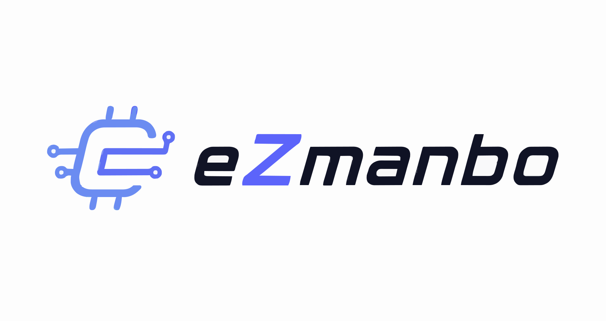

<div align="center">



# eZmanbo — 电子元器件选型与风险评估系统

[](https://github.com/Lucas-cs11/ezmanbo-agent)
[](https://www.python.org/)
[](https://nextjs.org/)
[](https://fastapi.tiangolo.com/)
[]()

**面向 eZ-PLM 的电子元器件选型、风险评估与报告导出系统**

[English](#english) | [中文](#chinese)

</div>

---

<h2 id="chinese">中文文档</h2>

### 快速开始

#### 前置要求
- **Python** 3.9+
- **Node.js** 18+
- **macOS / Linux / WSL2**

#### 一键部署

```bash
# 1. 克隆仓库
git clone https://github.com/Lucas-cs11/ezmanbo-agent.git
cd ezmanbo-agent

# 2. 配置 Python 环境、依赖与工程知识库
chmod +x setup.sh && ./setup.sh

# 3. 配置 API 密钥
# 编辑 .env，至少填写：
# EZPLM_API_KEY=your_key_here
# OPENAI_API_KEY=your_key_here
vim .env

# 4. 启动后端
source .venv/bin/activate
PYTHONPATH=. python3 -m uvicorn app.main:app --host 0.0.0.0 --port 8000

# 5. 启动前端（新终端窗口）
cd frontend/web && npm install && npm run dev
# 访问 http://localhost:3000
```

---

### 核心特性

#### 元器件选型
- **多约束条件支持**：输入电压、输出电压/电流、温度范围、应用等级、封装与拓扑等
- **流式结果反馈**：需求解析、检索、评分、风险与报告阶段通过 SSE 返回
- **自然语言交互**：支持“12V 转 5V、3A、车规”等混合表述

#### eZ-PLM 集成
- **HMAC-SHA256 请求签名**
- **eZ-PLM 器件信息检索与候选补全**
- **版本化结构化需求缓存**：仅复用相同约束指纹的选型结果

#### 候选评估与风险分析
- **约束检查、候选评分与排序推荐**
- **多维器件风险评估**：参数适配、可靠性、生命周期、供应、合规、质量、成本与数据完整性等
- **候选、风险与证据关联展示**

#### 工程知识库
- **ChromaDB 本地向量检索**
- **数据手册与工程设计知识检索**
- **本地知识库可用于检索增强与报告上下文**

#### 报告导出
- **BOM 导出**
- **器件级风险报告 Markdown**
- **选型决策包导出**

#### 多轮会话
- **会话管理与选型上下文保存**
- **替代方案查询、设计建议与对比分析**
- **账号认证与管理员配置入口**

---

### 功能矩阵

| 功能 | 说明 | 接口 |
|------|------|------|
| **流式选型** | 解析约束并流式返回候选、风险与证据 | `POST /chat/stream` |
| **选型分析** | 返回完整结构化选型结果 | `POST /analyze` |
| **意图分类** | 识别选型、对话与调整类请求 | `POST /classify` |
| **Agent 对话** | 多轮会话与工具调用 | `POST /agent/chat/stream` |
| **替代查询** | 查询兼容替代方案 | `POST /replacement` |
| **器件确认** | 确认当前会话的选中器件 | `POST /select-part` |
| **报告导出** | 获取风险、BOM 或拓扑报告内容 | `GET /report/{type}` |
| **BOM 导出** | 导出选中器件的 BOM | `POST /export/bom` |
| **决策包导出** | 导出选型决策包 | `POST /export/decision-package` |
| **文件解析** | 解析 PDF 或 Excel 需求文件 | `POST /upload/parse` |

---

### 环境变量配置

编辑 `.env` 文件：

```env
# eZ-PLM API
EZPLM_API_KEY=your_ezplm_api_key_here
EZPLM_BASE_URL=https://www.ezplm.cn

# LLM 服务，可使用 Anthropic 或 OpenAI 兼容接口
ANTHROPIC_API_KEY=
ANTHROPIC_BASE_URL=
OPENAI_API_KEY=your_openai_compatible_api_key_here
OPENAI_BASE_URL=
OPENAI_MODEL=

# Web UI 配置（可选）
CORS_ORIGINS=http://localhost:3000,http://localhost:8000
```

---

### 架构一览

```
┌─────────────────────────────────────────────────────────┐
│                   Web UI (Next.js 14)                    │
│     对话、会话管理、候选器件、风险与证据属性面板          │
└────────────────────┬────────────────────────────────────┘
                     │ SSE Streaming / HTTP API
┌────────────────────▼────────────────────────────────────┐
│                    FastAPI Backend                       │
├─────────────────────────────────────────────────────────┤
│  意图识别 → 需求解析 → 约束检查 → 候选评分 → 风险/证据   │
├─────────────────────────────────────────────────────────┤
│  eZ-PLM API  │  LLM 服务  │  ChromaDB 知识库  │  缓存层  │
└────────────────────┬────────────────────────────────────┘
                     │
         ┌───────────┴───────────┐
         │                       │
      eZ-PLM                 本地知识库
    （器件信息）          （数据手册与工程知识）
```

---

### 项目结构

```
ezmanbo-agent/
├── app/
│   ├── main.py                   # FastAPI 应用入口与选型接口
│   ├── auth.py                   # JWT 认证
│   ├── constraint_checker.py     # 约束检查
│   ├── intent_classifier.py      # 意图分类
│   ├── scoring.py                # 候选评分
│   ├── report_generator.py       # 风险与报告生成
│   ├── semantic_cache.py         # 结构化需求缓存
│   ├── ezplm_client.py           # eZ-PLM API 客户端
│   ├── react_agent.py            # 多轮会话处理
│   ├── rag.py                    # ChromaDB 检索
│   └── routers/                  # 认证与管理接口
│
├── frontend/
│   └── web/                      # Next.js 前端项目
│       ├── src/app/              # 页面与认证入口
│       ├── src/components/       # React 组件
│       ├── src/store/            # Zustand 状态管理
│       └── public/               # 静态资源
│
├── scripts/                      # 知识库、数据与维护脚本
├── data/                         # 本地知识库与缓存数据
├── tests/                        # 回归测试
├── .env.example                  # 环境变量示例
├── requirements.txt              # Python 依赖
├── setup.sh                      # 环境搭建脚本
└── README.md                     # 本文档
```

---

### 常见问题

**Q: 如何离线运行？**

本地知识库可用于数据手册和工程知识检索；eZ-PLM 器件检索及模型服务仍需配置对应服务。

**Q: 支持哪些模型服务？**

- Anthropic API
- OpenAI 兼容 API
- 其他可通过兼容接口配置的模型服务

**Q: 如何增加自定义知识？**

```bash
# 编辑 data/knowledge/ 下的内容后重建工程知识库
PYTHONPATH=. python3 scripts/build_knowledge_base.py
```

**Q: 如何启动多个后端进程？**

```bash
PYTHONPATH=. python3 -m uvicorn app.main:app --workers 4 --host 0.0.0.0 --port 8000
```

---

### 许可证

MIT License — 可自由使用、修改、商业化

---

### 贡献指南

欢迎 Pull Request。请确保：
1. 代码遵循现有风格
2. 新功能添加相应测试
3. 同步更新相关文档
4. Commit 消息清晰明确

---

<h2 id="english">English Documentation</h2>

### Quick Start

#### Prerequisites
- **Python** 3.9+
- **Node.js** 18+
- **macOS / Linux / WSL2**

#### Setup

```bash
# 1. Clone the repository
git clone https://github.com/Lucas-cs11/ezmanbo-agent.git
cd ezmanbo-agent

# 2. Configure the Python environment, dependencies, and engineering knowledge base
chmod +x setup.sh && ./setup.sh

# 3. Configure API keys in .env
# At minimum set EZPLM_API_KEY and OPENAI_API_KEY
vim .env

# 4. Start the backend
source .venv/bin/activate
PYTHONPATH=. python3 -m uvicorn app.main:app --host 0.0.0.0 --port 8000

# 5. Start the frontend in another terminal
cd frontend/web && npm install && npm run dev
# Visit http://localhost:3000
```

---

### Key Features

#### Component Selection
- Multi-constraint requirements for voltage, current, temperature, grade, package, and topology
- SSE streaming for parsing, retrieval, scoring, risk analysis, and reporting stages
- Natural-language component-selection requests

#### eZ-PLM Integration
- HMAC-SHA256 request signing
- eZ-PLM component retrieval and candidate enrichment
- Versioned structured-constraint cache for exact requirement reuse

#### Candidate Evaluation and Risk Analysis
- Constraint checking, candidate scoring, ranking, and recommendation
- Multi-dimensional risk analysis covering parameter fit, reliability, lifecycle, supply, compliance, quality, cost, and data integrity
- Linked candidates, risks, and evidence in the result panel

#### Engineering Knowledge Base
- Local ChromaDB vector retrieval
- Datasheet and engineering-knowledge retrieval
- Knowledge context for retrieval and reports

#### Report Export
- BOM export
- Part-level Markdown risk report
- Selection decision package export

#### Multi-turn Sessions
- Session management and selection context
- Replacement lookup, design suggestions, and comparison analysis
- Account authentication and administrator configuration

---

### Feature Matrix

| Feature | Description | API Endpoint |
|------|------|------|
| **Streaming Selection** | Streams candidates, risks, and evidence after requirement parsing | `POST /chat/stream` |
| **Selection Analysis** | Returns a complete structured selection result | `POST /analyze` |
| **Intent Classification** | Classifies selection, chat, and adjustment requests | `POST /classify` |
| **Agent Chat** | Multi-turn chat and tool calls | `POST /agent/chat/stream` |
| **Replacement Lookup** | Finds compatible alternatives | `POST /replacement` |
| **Part Selection** | Confirms a selected part in the current session | `POST /select-part` |
| **Report Export** | Gets risk, BOM, or topology report content | `GET /report/{type}` |
| **BOM Export** | Exports the BOM for the selected part | `POST /export/bom` |
| **Decision Package Export** | Exports a selection decision package | `POST /export/decision-package` |
| **File Parsing** | Parses PDF or Excel requirement files | `POST /upload/parse` |

---

### Environment Configuration

Edit `.env`:

```env
EZPLM_API_KEY=your_ezplm_api_key_here
EZPLM_BASE_URL=https://www.ezplm.cn

ANTHROPIC_API_KEY=
ANTHROPIC_BASE_URL=
OPENAI_API_KEY=your_openai_compatible_api_key_here
OPENAI_BASE_URL=
OPENAI_MODEL=

CORS_ORIGINS=http://localhost:3000,http://localhost:8000
```

---

### Architecture Overview

```
┌─────────────────────────────────────────────────────────┐
│                   Web UI (Next.js 14)                    │
│  Chat, session management, candidates, risk, and evidence│
└────────────────────┬────────────────────────────────────┘
                     │ SSE Streaming / HTTP API
┌────────────────────▼────────────────────────────────────┐
│                    FastAPI Backend                       │
├─────────────────────────────────────────────────────────┤
│ Intent → requirement parsing → checks → scoring → report │
├─────────────────────────────────────────────────────────┤
│  eZ-PLM API  │  LLM Service  │  ChromaDB KB  │  Cache    │
└────────────────────┬────────────────────────────────────┘
                     │
         ┌───────────┴───────────┐
         │                       │
       eZ-PLM            Local Knowledge Base
   (component data)   (datasheets and engineering knowledge)
```

---

### Project Structure

```
ezmanbo-agent/
├── app/                         # Backend modules
│   ├── main.py                  # FastAPI entry point and selection APIs
│   ├── auth.py                  # JWT authentication
│   ├── constraint_checker.py    # Constraint checking
│   ├── intent_classifier.py     # Intent classification
│   ├── scoring.py               # Candidate scoring
│   ├── report_generator.py      # Risk and report generation
│   ├── semantic_cache.py        # Structured requirement cache
│   ├── ezplm_client.py          # eZ-PLM API client
│   ├── react_agent.py           # Multi-turn session handling
│   ├── rag.py                   # ChromaDB retrieval
│   └── routers/                 # Authentication and administration APIs
├── frontend/web/                # Next.js frontend
├── scripts/                     # Knowledge-base, data, and maintenance scripts
├── data/                        # Local knowledge-base and cache data
├── tests/                       # Regression tests
├── .env.example                 # Environment-variable template
├── requirements.txt             # Python dependencies
├── setup.sh                     # Environment setup script
└── README.md                    # This document
```

---

### FAQ

**Q: Can it run offline?**

The local knowledge base can support datasheet and engineering-knowledge retrieval. eZ-PLM retrieval and model services still require their respective services to be configured.

**Q: Which model services are supported?**

- Anthropic API
- OpenAI-compatible APIs
- Other model services exposed through a compatible API

**Q: How do I add custom knowledge?**

```bash
PYTHONPATH=. python3 scripts/build_knowledge_base.py
```

**Q: How do I start multiple backend workers?**

```bash
PYTHONPATH=. python3 -m uvicorn app.main:app --workers 4 --host 0.0.0.0 --port 8000
```

---

### License

MIT License — Free to use, modify, and commercialize

---

### Contributing

Pull Requests are welcome. Please ensure:
1. Code follows existing conventions
2. New features include relevant tests
3. Related documentation is updated
4. Commit messages are clear
